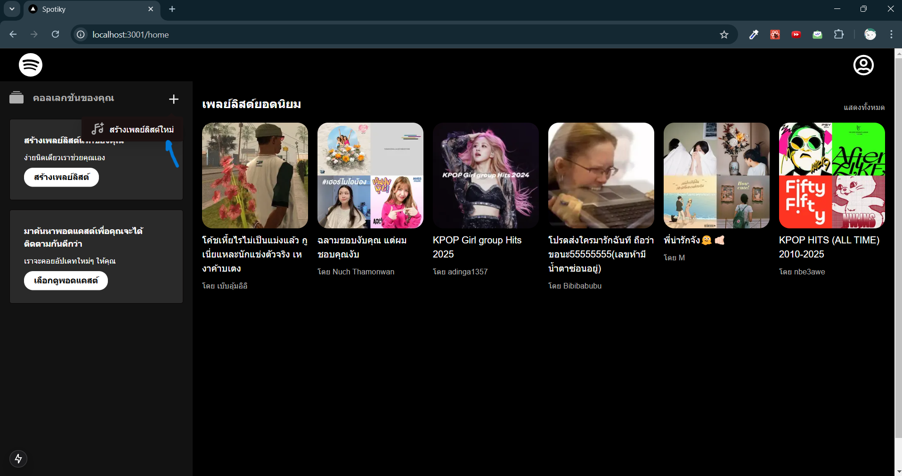
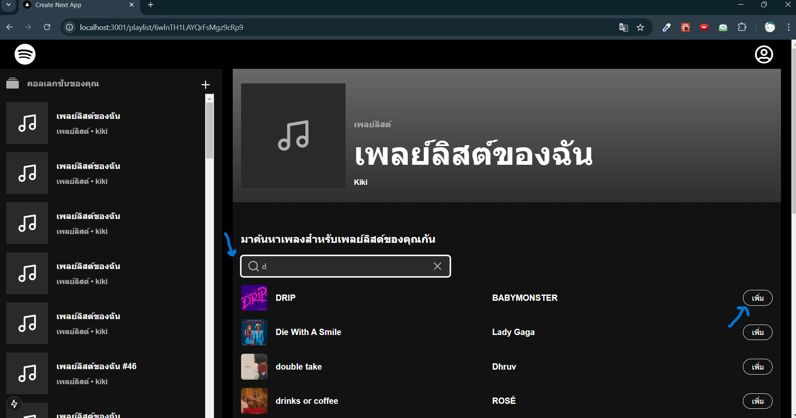
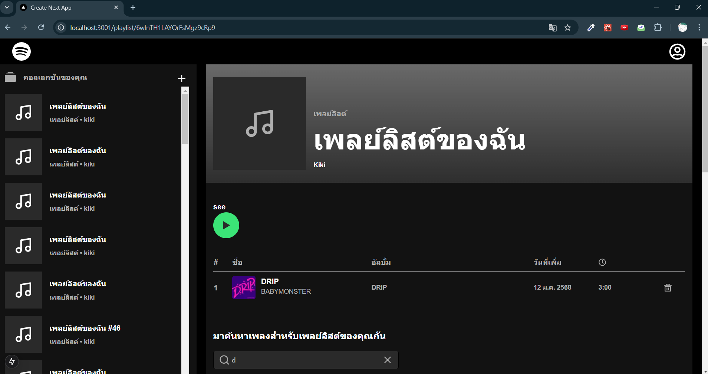

## Getting Started

First, run the development Frontend:

```bash
npm run dev
# or
yarn dev
# or
pnpm dev
# or
bun dev
```

Open [http://localhost:3001](http://localhost:3000) with your browser to see the result.

This is BackEnd [https://github.com/kiki-ananyaluck/spotiky-backend]

<h2>Steps</h2>

<h3>Step 1: Log In</h3>


<h3>Step 2: Create a New Playlist</h3>



<h3>Step 3: Search and Add Songs</h3>



<h3>Step 4: Songs Displayed in the Playlist</h3>

